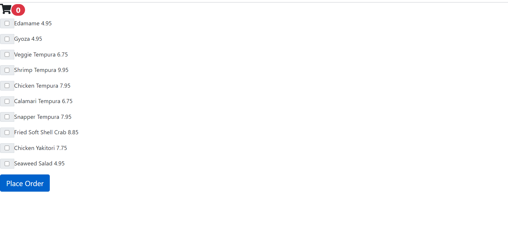

## Menu Component

 ## Description
 this is a reuseable menu component currently has some dumby data in it but can be paired with a back end to create an order from a resturant menu. currently not served up so would need to be run through node.js after forking the repo. 

## Table of Contents
* [intsallation](#Installation)
* [usage](#Usage)
* [Technology Utilized](#Technologies)
* [contributing](#Contributing)
* [Tests](#Tests)
* [User Story](#UserStory)
* [ScreenShot](#ScreenShot)
* [Github](#Github)

## Installation
fork or clone repo run npm i then yarn start to start project through node.js on localhost:3000 to install

## Usage
clicking the check boxes alerts adding(or removing if unchecking) to an order which also increments or decrements the cart number. the Place order button alerts a list of ordered items(this could be used with a back end or to submit an order) 

## Technologies
react, react-bootstrap, react-fontawesome, node.js, 

## License
used the undefined license

## Contributing
Jacob T LaMarre contributed to the design.

## Tests
try these test commands: try compiling your favorite order and watch as the cart decrements etc. 

## UserStory
AS A resturant owner
I WANT a modern way to keep track of an order
SO THAT place orders digitally or add to customer orders in the store. 

## ScreenShot

## Github
profile:jacobtlamarre
email: jacobtlamarre@gmail.com